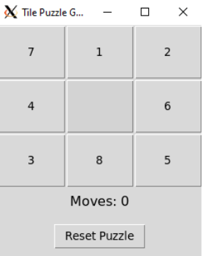

# 💻 CHEM 281 Lab: Text Editors, IDE's, & Development

## 🧪 Goal

The goal of this lab is to:

1. Familiarize yourself with **text editors and IDE's**.
2. Learn how to use **basic VIM commands**. 
3. Practice using **VIM** and **X11 Forwarding**.
4. Work with **tkinter** to fix bugs in a puzzle game.

---

## 🗂️ Provided

- A `docker` file to set up the dev environment.
- A complete tkinter based puzzle game with 3 bugs in `app.py`.

---

## 💻 Setup
```bash
./docker_build.sh # You may need to chmod +x
./docker_run.sh # Don't run it right away, but look at the command and get a feel of whats going on.
```
### FOR WINDOWS USERS OR WSL2

### 0. **Need Xhost**
```
which xhost # if you get a path you can move on

# If you don't have xhost, do the following:
sudo apt update
sudo apt install x11-utils
```
### 1. **Download `VcXsrv`**

Download from this link and install: (https://vcxsrv.com/)

This will function as a window into your docker container for its GUI.

### 2. **Export environment variable for X11 forwarding**
```
export DISPLAY=$(cat /etc/resolv.conf | grep nameserver | awk '{print $2}'):0
```
This sets the env variable DISPLAY to the IP address that it should forward the GUI to.
It might also be a good idea to add this to your .bashrc so it automatically gets populated on new terminal sessions.

### 3. **Open Xlaunch**

Open xlaunch should be installed under Program Files/VcXsrv/xlaunch
```
Choose: Multiple windows
Display number: -1
Uncheck Native OpenGL
Check "Disable access control" (important!)
Finish and leave VcXsrv running
```

From your linux terminal try running xeyes.
```
xeyes
```

### 4. **Run the docker container**
Once all the steps are completed above you can do the following:
```
./docker_run.sh
xeyes # sanity check
python3 app.py
```
You should be able to view the puzzle game!



## ✅ Tasks

### Find and fix 3 Bugs
This is a simple puzzle game where you click on adjacent tiles to fill in the empty tile spot and the aim is to get the tiles in the following order
```
[1 2 3
 4 5 6
 7 8  ]
```
If you are successful, a victory screen should display which you can close and then reset the game, which should randomize the blocks, and reset the
counter to start another session.

There are 3 bugs hidden amongst the game code which you need to solve using the `VIM` text editor. The first bug is that currently diagonal blocks are
allowed to occupy the empty space. This makes the puzzle trivial to solve BUT can be useful to find the other 2 bugs, so you might want to use this to
play around before fixing.

### Extra time
Look into the docker file and the bash scripts to get a sense of how the environment is set up and how environment variables are being passed around.
